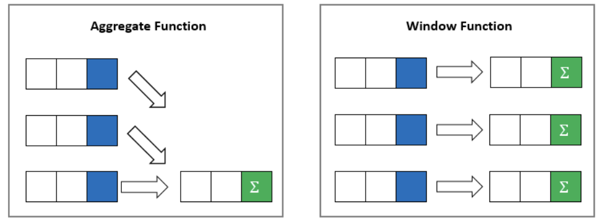
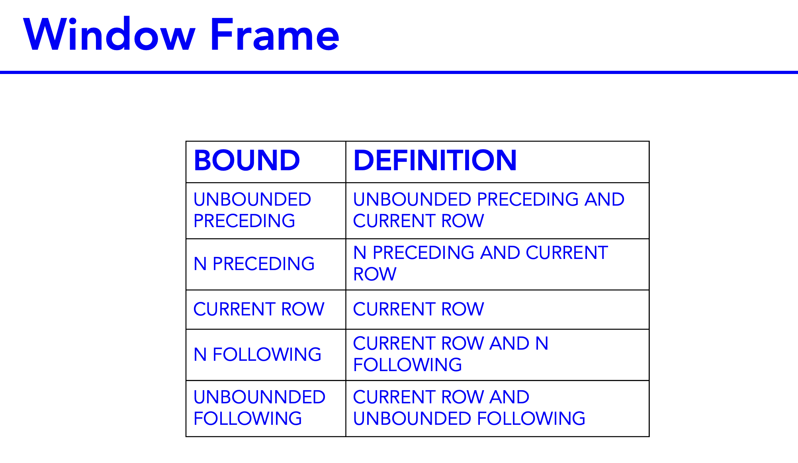
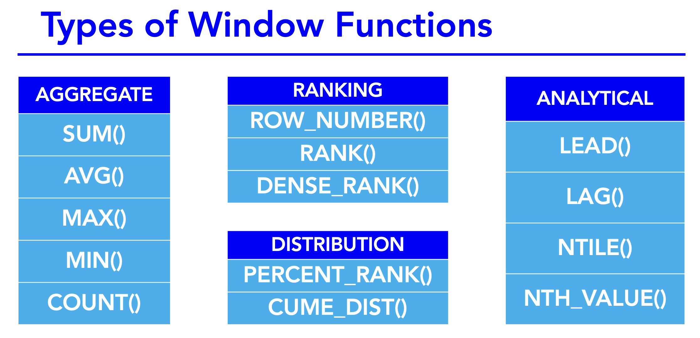

# [The Advanced SQL Course](https://www.udemy.com/course/the-advanced-sql-course-2021)

### Chapters:
1. Regular Expressions 
2. Analytic (Window) Functions
3. Group By extensions
4. Materialized Views
5. Hierarchical Queries
6. Common Table Expressions

## Data Cleaning & Manipulation
* Functions that deal with NULL values:
    - NVL()
    - Coalesce()
* Functions that can clean values:
    - Trim()
    - LPAD()
    - RPAD()
* Data Manipulation:
    - PIVOT
    - UNPIVOT


## RegEx and Pattern Matching
* Regular Expression functions in Oracle SQL:
    - REGEXP_LIKE
    - REGEXP_INSTR
    - REGEXP_SUBSTR
    - REGEXP_REPLACE


## Window (analytic) functions
These functions are very important. They calculate an aggregate value based on a group of rows. Unlike aggregate functions, analytic functions can return multiple rows for each group. We can use window functions to compute aggregated values, moving averages, running totals, percentages or top-N results within a group and much, much more. They use the **OVER()** clause.

Window functions do not collapse rows, but they are still able to compute aggregated values.



- Syntax:
    ```
    window_function_name ( expression ) OVER (
        partition_clause
        order_clause
        frame_clause
    )
    ```
    Where
    - ```window_function_name``` = name of the supported window function, like ```ROW_NUMBER()```, ```RANK()```, ```SUM()```.
    - ```expression``` = the target column/expression on which the window function operates
    - ```OVER``` clause = it defines window partitions to form the groups of rows and specifies the orders of rows in partition. 
    OVER() simply written with no arguments inside the parenthesis aggregates all rows in the table. 
    The ```OVER``` clause consists of 3 clauses:
        1. **PARTITION clause** = divides the rows into the partitions on which the window function applies.
            ```
            PARTITION BY expr1, expr2,...
            ```
            If the partition clause is not specified, it is as if the result is treated as a single partition.
            The result is ordered by default by the column we partitioned on
        2. **ORDER clause** = orders the rows in a partition on which the window function operates
            ```
            ORDER BY expression [ASC | DESC] [NULL {FIRST | LAST}], ...
            ```
        3. **FRAME clause** = a frame is a subset of the current partition. To define the frame, you use one of the following syntaxes:
            ```
            [RANGE | ROWS] frame_start

            [RANGE | ROWS] BETWEEN frame_start AND frame_end
            ```
            Where  ```frame_start``` is one of:
            ```
            - N PRECEDING (a row that is N rows above the current row)
            - UNBOUNDED PRECEDING (unbounded preceding and the current row)
            - CURRENT ROW
            ```
            and ```frame_end``` is one of:
            ```
            CURRENT ROW
            UNBOUNDED FOLLOWING 
            N FOLLOWING (current row and unbounded following)
            ```
            Note! For RANGE, you must have something in the ORDER BY clause., because RANGE gets nummerical values based on the order by column.
            
            

#### SQL Window function types:
- Value window functions
    - FIRST_VALUE()
    - LAG()
    - LAST_VALUE()
    - LEAD()

- Ranking window functions
    - CUME_DIST()
    - DENSE_RANK()
    - NTILE()
    - PERCENT_RANK()
    - RANK()
    - ROW_NUMBER()

- Aggregate window functions
    - AVG()
    - COUNT()
    - MAX()
    - MIN()
    - SUM()


